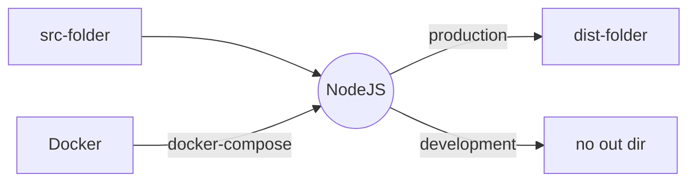

# Empty GraphQL Service

This project uses

- SQL
- Docker
- TypeOrm
- Type-Graphql
- express

## Getting started

### Docker

Docker is a tool to help with containerization of the project. Containerization helps with running the program on different machines seemless. This project requires Docker and Docker compose to be fully working(it currently is possible to run this project without docker, bu then you need an SQL database running). Project is tested with docker version `Docker version 20.10.2, build 2291f61` and docker-compose version `docker-compose version 1.27.4, build 40524192`.

- Install [Windows](https://docs.docker.com/docker-for-windows/install/)
- Install [Mac](https://docs.docker.com/docker-for-mac/install/)
- Install [Ubuntu](https://docs.docker.com/engine/install/ubuntu/)

### NodeJS

NodeJS is a JavaScript runtime to be able to execute JavaScript. To install NodeJS

- [Install](https://nodejs.org/en/download/)
- run `node --version` should give something like v12.13.1.
- run `npm --version` should give something like 6.14.7.

### This project

This project uses TypeScript which is compiled to JavaScript. TypeScript is a superset of JavaScript it is installed on project level.

- **Install**, install all dependencies by running, `npm run install`
- **Env**, copy over .env.example => .env.
  - Edit some values if you want to run on another port(optional)
- **Start container**, `npm run docker:dev`

(for a more in depth description fo the scripts, please read in the **Scripts** section).

## Enviroment

This project uses a _.env_ file which should be located at the project root (i. e. next to the src/ folder). If you look at the _.env.example_ you should be able to see all the varbiles which are required. Certain env variables are sat up in the container for ease of use and therefore are not required in the _.env_ file

## Scripts

- `npm run start` - Starts the application **without** compiling it to JS.

- `npm run start:dev`- Starts application for development. Refreshes the server when any changes is made.

- `npm run build`- Compiles and build the application. Produces a dist folder which can be run directly by NodeJS without TypeScript.

- `npm run migrate` - TypeOrm migration helper function mainly used by other scripts. You probably will not need to use this one!

- `npm run migrate:run`- Runs all the migrations in the migration folder and hence sets up the connected database. [Click here for more information](https://github.com/typeorm/typeorm/blob/master/docs/migrations.md#running-and-reverting-migrations).

- `npm run migrate:generate`- Generates all the changes from the ORM model. [Click here for more information](https://github.com/typeorm/typeorm/blob/master/docs/migrations.md#generating-migrations).

- `npm run migrate:create` - Creates an empty migration. Needs to get an --name(-n) argument. [Click here for more information](https://github.com/typeorm/typeorm/blob/master/docs/migrations.md#creating-a-new-migration).

- `npm run docker:dev` - Starts a local docker container for both the service and a SQL databases. Runs all the migration in a seperate container and then listens to the changes to the in the src/ folder.

- `npm run docker:reset` - Creates a hard reset on the docker container.

- `npm run test` - Runs all the test files declared

- `npm run test:integration` - Runs all the integration test files declared

- `npm run test:lint` - Makes sure that no linting warning appear in the project.

- `npm run lint:fix` - Fixes all the automatic linting issues in the src folder.

- - `npm run git:pre-push` - This is a helper function which can help you to always make sure that you push code that is valid. This can be made automaticly by running

## Testing

Testing is done using jest. It has two types of tests normal (ends with _\*.test.ts_) and integration tests(ends with _\*.i.test.ts_). The normal test should be used as simple unit tests and integration test can be used to when more complex testing enviroment is required.
